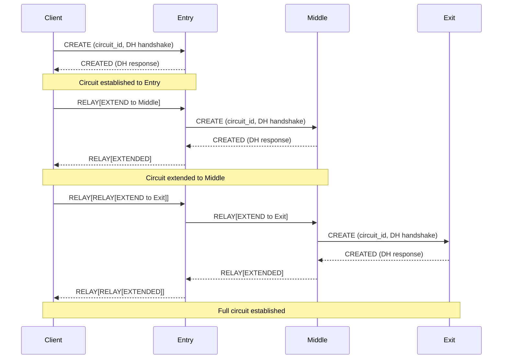
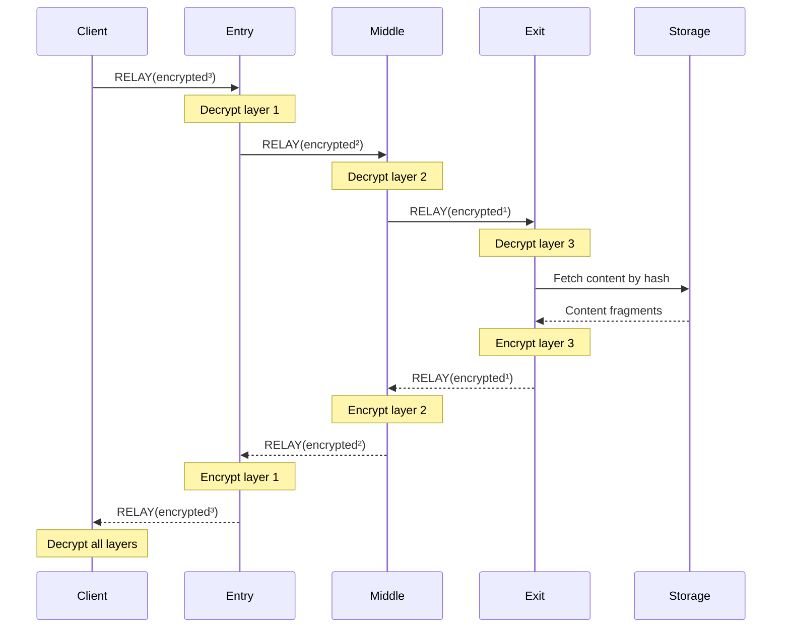

# Zero-Knowledge Relay Protocol

The Zero-Knowledge (ZK) Relay protocol is ShadowMesh's core privacy layer that ensures relay nodes can serve content **without knowing what they're serving**. This provides plausible deniability for relay operators.

## Overview

The ZK Relay implements a circuit-based onion routing system similar to Tor, but optimized for content delivery:

```
┌────────┐     ┌─────────┐     ┌─────────┐     ┌─────────┐     ┌─────────┐
│ Client │────▶│ Entry   │────▶│ Middle  │────▶│ Exit    │────▶│ Content │
│        │◀────│ Relay   │◀────│ Relay   │◀────│ Relay   │◀────│ Source  │
└────────┘     └─────────┘     └─────────┘     └─────────┘     └─────────┘
     │              │               │               │
     │              │               │               │
  Knows:         Knows:          Knows:          Knows:
  - Content      - Client IP     - Entry IP      - Middle IP
  - Full route   - Middle IP     - Exit IP       - Content hash
                 - NOT content   - NOT content   - NOT client
```

## Key Concepts

### 1. Circuits

A **circuit** is a pre-established path through 2+ relay nodes. All traffic for a session flows through the same circuit.

```rust
use shadowmesh_protocol::{ZkRelayClient, KEY_SIZE};

let secret = [42u8; KEY_SIZE];
let mut client = ZkRelayClient::new(secret);

// Build a circuit through 3 relays
let circuit_id = client.build_circuit(&relay_peers)?;
```

### 2. Layered Encryption (Onion Routing)

Each layer of encryption can only be removed by the corresponding relay:

```
Original: "GET /content/abc123"

After wrapping:
┌─────────────────────────────────────────────────────┐
│ Layer 3 (Exit key): encrypted payload               │
│ ┌─────────────────────────────────────────────────┐ │
│ │ Layer 2 (Middle key): encrypted payload         │ │
│ │ ┌─────────────────────────────────────────────┐ │ │
│ │ │ Layer 1 (Entry key): encrypted payload      │ │ │
│ │ │ ┌─────────────────────────────────────────┐ │ │ │
│ │ │ │ Original request                        │ │ │ │
│ │ │ └─────────────────────────────────────────┘ │ │ │
│ │ └─────────────────────────────────────────────┘ │ │
│ └─────────────────────────────────────────────────┘ │
└─────────────────────────────────────────────────────┘
```

### 3. Relay Cells

Communication happens via **cells** - fixed-size packets:

| Cell Type | Purpose |
|-----------|---------|
| `Create` | Establish new circuit |
| `Created` | Acknowledge circuit creation |
| `Extend` | Add hop to circuit |
| `Extended` | Acknowledge extension |
| `Relay` | Carry encrypted data |
| `Destroy` | Tear down circuit |
| `Padding` | Traffic analysis resistance |

### 4. Blind Requests

Even exit nodes only see content hashes, never URLs:

```rust
use shadowmesh_protocol::BlindRequest;

let request = BlindRequest::new(
    "bafybeigdyrzt5sfp7udm7hu76uh7y26nf3efuylqabf3oclgtqy55fbzdi".to_string()
);
```

## Protocol Flow

### Circuit Building



### Content Request



## API Reference

### ZkRelayClient

Client-side circuit management:

```rust
use shadowmesh_protocol::{ZkRelayClient, ZkRelayConfig, KEY_SIZE};
use std::time::Duration;

// Create client with default config
let secret = [0u8; KEY_SIZE]; // Use secure random in production
let mut client = ZkRelayClient::new(secret);

// Or with custom config
let config = ZkRelayConfig {
    default_hops: 3,
    circuit_lifetime: Duration::from_secs(600),
    max_circuits: 10000,
    padding_enabled: true,
    padding_interval: Duration::from_millis(100),
    cell_timeout: Duration::from_secs(30),
};
let mut client = ZkRelayClient::with_config(secret, config);

// Build circuit
let circuit_id = client.build_circuit(&relay_peers)?;

// Wrap request
let cell = client.wrap_request(&circuit_id, b"request data")?;

// Get entry node (where to send)
let entry = client.get_entry_node(&circuit_id)?;

// Unwrap response
let response = client.unwrap_response(&circuit_id, &response_cell)?;

// Cleanup
client.destroy_circuit(&circuit_id);
client.cleanup_expired();
```

### ZkRelayNode

Relay node implementation:

```rust
use shadowmesh_protocol::{ZkRelayNode, RelayAction, KEY_SIZE};

let node_secret = [0u8; KEY_SIZE];
let node = ZkRelayNode::new(node_secret);

// Process incoming cell
match node.process_cell(cell, from_peer)? {
    RelayAction::Forward { cell, to_peer } => {
        // Forward to next hop
        send_to_peer(to_peer, cell);
    }
    RelayAction::Respond(response) => {
        // Send response back
        send_to_peer(from_peer, response);
    }
    RelayAction::Exit { data, circuit_id } => {
        // We're the exit - fetch content
        let content = fetch_content(&data);
        // Wrap and send back
    }
    RelayAction::Drop => {
        // Silently drop (padding, etc.)
    }
}

// Get stats
let stats = node.stats();
println!("Relayed {} cells, {} bytes", stats.cells_relayed, stats.bytes_relayed);
```

### BlindRequest / BlindResponse

Content-addressed requests:

```rust
use shadowmesh_protocol::{BlindRequest, BlindResponse};

// Create request
let request = BlindRequest::new("content_hash".to_string());

// With byte range
let range_request = BlindRequest::with_range("content_hash".to_string(), 0, 1024);

// Response
let response = BlindResponse {
    request_id: request.request_id,
    encrypted_content: encrypted_data,
    content_hash: "content_hash".to_string(),
    success: true,
    error: None,
};
```

### TrafficPadder

Traffic analysis resistance:

```rust
use shadowmesh_protocol::TrafficPadder;

let padder = TrafficPadder::with_size(512);

// Pad small data
let padded = padder.pad(b"small data");
assert_eq!(padded.len(), 512);

// Add timing jitter
let delay = padder.get_jitter();
tokio::time::sleep(delay).await;
```

## Security Properties

### What Relays DON'T Know

| Relay Type | Doesn't Know |
|------------|--------------|
| Entry | Content being requested, final destination |
| Middle | Client IP, content, destination |
| Exit | Client IP, which entry node |
| All | Full route, unencrypted content |

### What Relays DO Know

| Relay Type | Knows |
|------------|-------|
| Entry | Client IP, next hop IP |
| Middle | Previous hop IP, next hop IP |
| Exit | Previous hop IP, content hash (not content) |

### Threat Model

**Protected against:**
- ✅ ISP monitoring traffic
- ✅ Single relay compromise
- ✅ Content takedown requests (no one knows what they serve)
- ✅ Traffic analysis (with padding)
- ✅ Timing attacks (with jitter)

**NOT protected against:**
- ❌ Global adversary (can correlate entry/exit traffic)
- ❌ All relays in circuit compromised
- ❌ Client-side malware

## Configuration

### Circuit Settings

```rust
ZkRelayConfig {
    // Number of hops (minimum 2, recommended 3)
    default_hops: 3,
    
    // How long circuits live (trade-off: security vs performance)
    circuit_lifetime: Duration::from_secs(600),
    
    // Maximum concurrent circuits per relay
    max_circuits: 10000,
    
    // Traffic analysis resistance
    padding_enabled: true,
    padding_interval: Duration::from_millis(100),
    
    // Request timeout
    cell_timeout: Duration::from_secs(30),
}
```

### Performance Tuning

| Setting | Faster | More Private |
|---------|--------|--------------|
| `default_hops` | 2 | 4+ |
| `circuit_lifetime` | Longer | Shorter |
| `padding_enabled` | false | true |
| `padding_interval` | Longer | Shorter |

## Integration Example

Complete workflow:

```rust
use shadowmesh_protocol::{
    ZkRelayClient, ZkRelayNode, BlindRequest, 
    RelayAction, KEY_SIZE,
};

// === Client Side ===
let client_secret = [1u8; KEY_SIZE];
let mut client = ZkRelayClient::new(client_secret);

// Select relay nodes (from DHT/peer discovery)
let relays = discover_relays(3);

// Build circuit
let circuit_id = client.build_circuit(&relays)?;

// Create blind request (content hash only, not URL)
let request = BlindRequest::new(content_hash);
let request_bytes = bincode::serialize(&request)?;

// Wrap in onion layers
let cell = client.wrap_request(&circuit_id, &request_bytes)?;

// Send to entry node
let entry = client.get_entry_node(&circuit_id)?;
send_to_peer(entry, cell);

// === Relay Side (each relay) ===
let node_secret = [2u8; KEY_SIZE];
let node = ZkRelayNode::new(node_secret);

// Relay processes cell
match node.process_cell(incoming_cell, from_peer)? {
    RelayAction::Forward { cell, to_peer } => {
        // Just forward - relay has no idea what's inside
        send_to_peer(to_peer, cell);
    }
    RelayAction::Exit { data, circuit_id } => {
        // Exit node - fetch by hash
        let request: BlindRequest = bincode::deserialize(&data)?;
        let content = storage.get(&request.content_hash)?;
        
        // Wrap response and send back
        // ...
    }
    // ...
}

// === Client receives response ===
let response_data = client.unwrap_response(&circuit_id, &response_cell)?;
let response: BlindResponse = bincode::deserialize(&response_data)?;
// Decrypt content with content key (separate from circuit keys)
```

## Testing

Run ZK relay tests:

```bash
cargo test -p protocol zk_relay
```

Run integration tests:

```bash
cargo test -p protocol --test integration_tests
```

## Future Enhancements

- [ ] ECDH key exchange (currently simplified derivation)
- [ ] Path selection algorithm (proximity, reliability)
- [ ] Circuit preemptive building
- [ ] Onion service support (hidden services)
- [ ] Guard node selection
- [ ] Directory authorities
